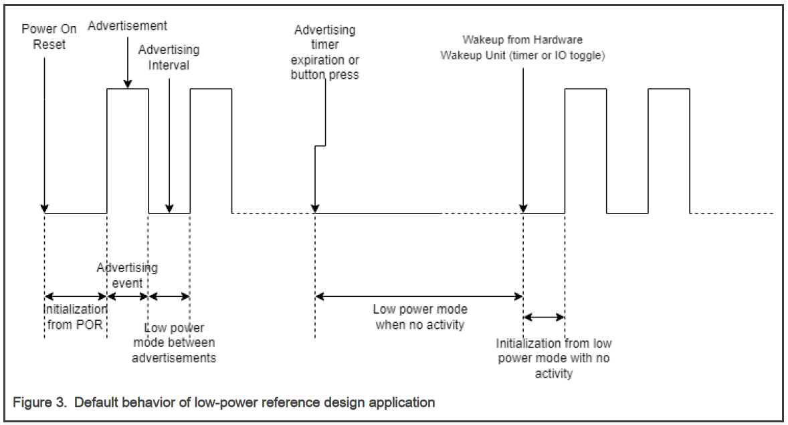

# Low-power reference design applications
----------------------------------------
Two low-power reference design applications are provided in the reference_design folder:
  - Low power peripheral application demonstrating the low power feature on an advertiser peripheral Bluetooth LE device.
  - Low power central application demonstrating the low power feature on a scanner central Bluetooth LE device.
  
These applications aim at providing:
  - A reference design application for low power/timing optimization on a Bluetooth Low Energy application. These can be used in first intent for porting a new application on low power.
  - A way for measuring the power consumption, wake-up time, and active time in various power modes. The default low-power mode used in different modes are shown as follows:

|Default power mode | App core | Radio core |
|:---               | :----:   |       ---:|
|Advertise mode | Power Down mode | Deep sleep mode|
|Connected mode | Deep Sleep mode | Deep Sleep mode |
|Scanning mode | Deep Sleep mode | WFI or Deep Sleep mode |

Default Low Power modes of KW45-EVK board, supported in different modes of the Core units.

The projects are at the following relative path: <installation_path>\boards\<board_name>\wireless_examples\reference_design\bluetooth\reference_design\bluetooth\lp

## 1 - Low-power peripheral reference design application
The low-power peripheral reference design application is based on the temperature sensor example and has all Bluetooth services that the temperature sensor offers. In addition, it has the low-power feature enabled and optimized. The user can easily configure features such as Bluetooth advertising parameters, and other parameters related to the application, so that they can customize the application according to their eventual needs.

The low-power peripheral reference design application provides the following low-power features:
  - Low-power modes in advertising and connected modes: Application core goes to Deep Sleep and wakes up only when the radio core sends a message to the host stack. The radio core goes to Deep Sleep between each Bluetooth LE event.
  - Wake-up from Low Power modes with wake-up sources such as Radio, Low-power timers, and IOs.
  - In ble_conn_manager.h file, the user can set the preferred LE PHY setting (1M/2M/Coded) with the definition of gConnDefaultTxPhySettings_c, gConnDefaultRxPhySettings_c, and gConnInitiatePhyUpdateRequest_c.
  - ADV in various configurations:
    - Connectable / not connectable,
    - ADV payload, Scan Response Payload,
    - Extended ADV

### 1.1 - Implemented Bluetooth LE profiles and services
The low-power reference design peripheral application is based on the Temperature Sensor application. It implements a GATT server, a custom profile, and the following services.
  - Temperature Service (UUID: 01ff0200-ba5e-f4ee-5ca1-eb1e5e4b1ce0)
  - Battery Service v1.0
  - Device Information Service v1.1

The application behaves as a GAP peripheral node. It enters GAP General Discoverable Mode and waits for a GAP central node to connect and configure notifications for the temperature value.

The Temperature service is a custom service that implements the Temperature characteristic (UUID: 0x2A6E) with a Characteristic Presentation Format descriptor (UUID: 0x2904), both defined by the Bluetooth SIG.

The default advertisement message is the same as the temperature sensor demo:

|Length | Type | Value |
|:---               | :----:   |       ---:|
|2 | x01(AdFlag) | 0x06|
|17 | 0x07(AdComplete128bitServiceList) | 0xE01C4B5E1EEBA15CEEF45EBA0002FF01 |
|9 | 0x08(AdShortenedLocalName) | 0x4E58505F54454D50 |

The scan response is empty by default. The advertisement message length is 2+17+9+3 (number of bytes for “length” information) = 31 bytes.

The advertising interval is set to 500 ms by default, it advertises on all 3 ADV channels. and it is connectable. Users can establish a connection with the device by using either another KW45 board programmed with a low-power central device, “temperature_collector” demo, or with a smartphone compatible with Bluetooth 4.2 or above.

### 1.2 - Running the low-power reference design peripheral application
Once the Kinetis device is programmed with the low-power reference design demo project, and after a power cycle, it starts to advertise every 500 ms as soon as the hardware and software initializations are completed. This allows users to measure the start-up time from Power-On-Reset to the first TX. The power consumption for one advertising event, as well as the current between two advertising events can also be measured. The same applies to the case when the device is connected to another Bluetooth central device where it allows the measurement of the power consumption of the connection event.

A low-power timer of 30 seconds is set at the beginning of advertising, so the device stops advertising when this timer expires. The user can also stop the advertisement by pressing the button SW2. When advertising stops, the user can easily perform power consumption measurement of the state where the main domain is in Deep Power Down mode and the Radio domain is also in this mode.

The MCU stays in this mode until the wake-up from one of the wake up sources. By default, the wake up sources are WUU pins (including the SW2 button). At wake-up, the device starts to advertise immediately, just like waking up from a Power-On-Reset. This allows the user to measure the wake-up time.

The low-power reference design freertos application by default will wake up from lowpower 8 seconds after stopping any activity to demonstrate the tickless mode feature. You can adjust the timeout with the gAppTaskWaitTimeout_ms_c flag in the app_preinclude.h file, its value in our demo is 8000ms. If this flag is not defined in the application its value will be osaWaitForever_c and there will be no OS wake up.

The graph below illustrates the default behavior of the low-power reference design application:

The user can connect to the device anytime when this last is in advertising state. The connection automatically disconnects when the temperature value is sent to the peer device, or after 10 seconds timer (started from connection establishment).

#### 1.2.1 - Software configurations
To make the power measurement simpler for different use cases and hardware configurations, the low-power reference design offers options to configure the EVK board and the application.
#### 1.2.2 - Application configuration
The Low Power service is initialized in app_services_init(). By default, both domains enter Deep Sleep mode whenever it is possible.

New APIs at application level are introduced to simplify the usage of the low power module:
  - 1.BleApp_SetLowPowerModeConstraint: The developer sets its parameter according to its state: gAppLowPowerConstraintInAdvertising_c, gAppLowPowerConstraintInConnected_c or gAppLowPowerConstraintInNoBleActivity_c, and the Low Power manager automatically enters the suitable Low Power mode.
  - 2.BleApp_ReleaseLowPowerModeConstraint: When the constraints change and the application needs to go to a different Low Power mode, this API is called to release the previous constraints.
  
The application configuration parameters are directly described in the app_preinclude.h file in the project. Some highlights on the parameters available:
- gAppExtAdvEnable_d to 1: enables the capability to perform extended advertising event (requires OPT host lib).
- gAppRestartAdvAfterConnect to 1: when connection ends, the device restarts advertising mode. The device goes in deep sleep mode between advertising intervals.
- gPlatformDcdcBuckMode_d: allows to disable the DCDC if it is set to 0 (requires HW changes).
- gAPPLowpowerEnabled_d to 0: disables low power (for sanity test without low power).

## 2 - Low-power reference design central application
The low-power central reference design application is based on the temperature collector example that acts as a GAP central. In addition, it has the low-power feature enabled and optimized. The user can easily configure features such as Bluetooth scanning parameters, and other parameters related to the application, so that they can customize the application according to their eventual needs.
### 2.1 - Features
The low-power Central reference design application provides the following low-power features:
- Application core in Deep Sleep mode during scan and connection with selective RAM retention.
- Wake-up from Low Power mode with wake-up source such as Radio, Low-power timers, and IO.

The lp central application supports a Shell to output information from the device on LPUART interface. However, the shell is not source of wake-up when in Low-Power modes.

The Low-power reference design peripheral application supports up to 8 simultaneous connections: 7 lp central and one smartphone, or 8 lp central devices. However, the temperature service only supports one subscriber at a time.

By default, the first connected device is subscribed to temperature service and battery service. Only then, the other devices are subscribed to the battery service. The Low power central reference design is improved to also support battery notifications. Now, Low power central reference design also looks for battery service, enables its notifications and gets notified. It makes it not only a temperature_collector clone, as it can read battery level of the peripheral. No tweaking is needed, this feature is available by default.

### 2.2 - Running the low-power central reference design application
The application behavior is as follows:

At POR, start scanning immediately, scanning stops in the following cases:
- On SW2 button press. When scanning is stopped, the device enters the Low Power mode.
- On 30 sec timer expiration, then goes to Deep Sleep mode.
- On connection establishment.

It establishes automatically a connection with a low-power reference design application (lp refdes app) or a temperature sensor by checking the temperature sensor service's UUID in the advertising message and retrieves the temperature value. Note that Low Power Reference Design disconnects immediately after temperature is received.

On disconnect, the Application core and radio core go to Deep Sleep mode with full RAM retention. If gAppRestartScanAfterConnect is set to 1, the radio core restarts the scan activity. Application core still goes to Deep Sleep mode between messages from CM3. SW2 button has no effect.

Shell over LPUART peripheral outputs scanning, connection information, and temperature value.
### 2.3 - Application configuration
Details on the Application configuration parameters are directly described in the app_preinclude.h file of the project.

Some highlights on the parameters in app_preinclude.h that can be changed for this application are given here:
- gDebugConsoleEnable_d to 1: Enables PRINTF.
- gAppUseBonding_d and gAppUsePairing_d to 0: Must be aligned to the same configuration as the peripheral device.
- gAppUsePrivacy_d to 0: must be aligned with the peripheral device.
- gAppExtAdvEnable_d to 1: enables the capability to scan and print scanned Extended Advertisements (requires OPT host lib).
- gAppRestartScanAfterConnect to 1: when connection ends, the device switches back to Scan mode.
- gPLATFORM_DisableNbuLowpower_d to 1: prevents Radio domain to go to Low Power mode.
- gAppLowpowerEnabled_d to 0: disables Low Power (for sanity test without low power).
